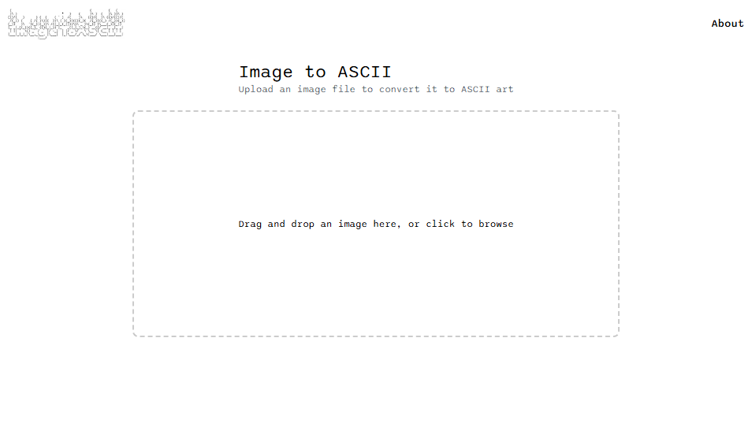

# Image to ASCII
This project is a web-based application that allows users to upload an image and convert it into ASCII art. The application is divided into two parts: the frontend, built with Next.js, and the backend, built with Node.js and Express.

## Features
- Drag-and-drop image upload or file browsing.
- Converts uploaded images into ASCII art.
- Simple and responsive user interface.

## Technologies Used

### Frontend
- **Next.js**: Framework for building the frontend.
- **React**: Library used for building the UI.
- **TailwindCSS**: Styling framework for responsive design.
- **SASS**: Used for additional styling in specific components.

### Backend
- **Node.js**: Runtime environment for backend development.
- **Express**: Lightweight web framework for handling API requests.



## Setup Instructions

### Prerequisites
- Node.js and npm installed.

### Frontend Setup
1. Clone the repository:
   ```bash
   git clone https://github.com/Hctor11/image-to-ascii.git
   cd image-to-ascii/frontend
   ```
2. Install dependencies:
   ```bash
   npm install
   ```
3. Start the development server:
   ```bash
   npm run dev
   ```

### Backend Setup
1. Navigate to the backend directory:
   ```bash
   cd image-to-ascii/backend
   ```
2. Install dependencies:
   ```bash
   npm install
   ```
3. Run the Express server:
   ```bash
   node index.js
   ```

